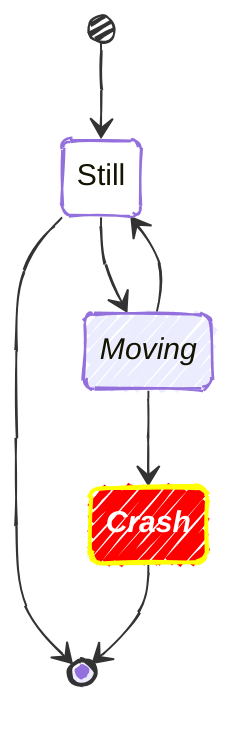

Page 1:
MarkdownAIは、Markdownを基盤にしたAI駆動開発ツールです。
Markdownでの各種設計書を作成し、Web開発を行う、仕様駆動開発ツールです。

Page 2:
縦長動画Top10は、ショート動画をTop10形式でランキング形式で紹介する、動画キュレーションサイトです。

Page 3:
HyperBook Projectは、Markdownを用いた書籍開発ツールで、現代のHyperCardを目指します。

Page 4:

Page 5:
縦長動画Bookは、HyperBook Projectを利用した、ショート動画を本形式でパッケージにした、デジタル書籍です。
